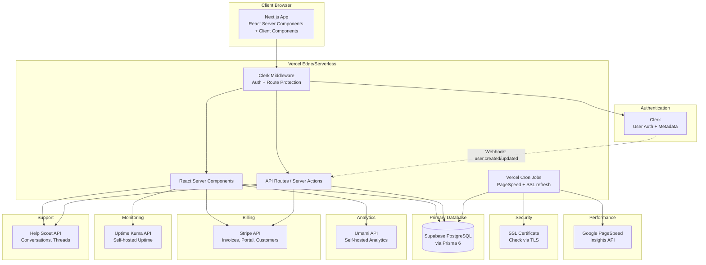

# APMUC Portal — Architecture Document

## 1. System Design Overview

### High-Level Summary

The **apmuc-portal** is a combined client portal serving hosting and maintenance retainer clients of All Phase Media (APM) and UnionCoded (UC). It replaces the existing `clientsupport.app` with a modern Next.js 15 dashboard that aggregates data from multiple external services into a single, branded client experience.

The application follows a **server-first** architecture. All external API calls (Stripe, Help Scout, Umami, Uptime Kuma, PageSpeed, SSL checks) happen exclusively on the server side to protect API keys. The client receives pre-rendered data through React Server Components where possible, with targeted client interactivity for forms, filters, and real-time updates.

Authentication is delegated entirely to **Clerk**, which manages user accounts, sessions, and role-based access via public metadata. The local database (Supabase PostgreSQL via Prisma 6) stores client configuration, knowledge base content, and feedback — but never user passwords or session tokens.

### Architecture Diagram



### Key Architectural Decisions

| Decision | Rationale |
|---|---|
| **Clerk** instead of NextAuth | Eliminates password management, provides pre-built UI, JWT sessions at edge, webhook sync |
| **Prisma 6** (not 7) | Standard `@prisma/client` generator, `url`/`directUrl` in schema, no adapter required |
| **Server Actions** for mutations | Type-safe form handling with progressive enhancement |
| **API Routes** for webhooks only | Stripe/Clerk webhooks and cron endpoints |
| **React Server Components** for data | Fetch external API data server-side, stream to client, API keys never reach browser |
| **Cached PageSpeed/SSL in DB** | Checks are slow (2-5s), cached in DB, refreshed via Vercel cron every 6 hours |
| **Help Scout REST API** (not widget) | Full conversation management within the portal UI |
| **Stripe Customer Portal** | Uses Stripe's hosted portal with cancellation disabled |

---

## 2. Data Models

### Prisma Schema

```prisma
generator client {
  provider = "prisma-client-js"
}

datasource db {
  provider  = "postgresql"
  url       = env("DATABASE_URL")
  directUrl = env("DIRECT_URL")
}

enum ServiceType {
  HOSTING
  MAINTENANCE
  SEO
  GOOGLE_ADS
  SOCIAL_MEDIA
  WEB_DESIGN
  EMAIL_MARKETING
  CONTENT_WRITING
  BRANDING
  OTHER
}

enum ArticleStatus {
  DRAFT
  PUBLISHED
  ARCHIVED
}

model Client {
  id                  String          @id @default(uuid())
  clerkUserId         String?         @unique
  email               String          @unique
  name                String
  company             String?
  websiteUrl          String?
  stripeCustomerId    String?         @unique
  umamiSiteId         String?
  uptimeKumaMonitorId String?
  gaPropertyId        String?
  searchConsoleUrl    String?
  isActive            Boolean         @default(true)
  notes               String?
  createdAt           DateTime        @default(now())
  updatedAt           DateTime        @updatedAt

  services            ClientService[]
  siteChecks          SiteCheck[]

  @@index([clerkUserId])
  @@index([email])
  @@index([stripeCustomerId])
}

model ClientService {
  id        String      @id @default(uuid())
  clientId  String
  type      ServiceType
  label     String?
  isActive  Boolean     @default(true)
  createdAt DateTime    @default(now())
  updatedAt DateTime    @updatedAt

  client    Client      @relation(fields: [clientId], references: [id], onDelete: Cascade)

  @@unique([clientId, type])
  @@index([clientId])
}

model SiteCheck {
  id                 String    @id @default(uuid())
  clientId           String
  url                String
  performanceScore   Int?
  accessibilityScore Int?
  bestPracticesScore Int?
  seoScore           Int?
  sslValid           Boolean?
  sslIssuer          String?
  sslExpiresAt       DateTime?
  checkedAt          DateTime  @default(now())

  client             Client    @relation(fields: [clientId], references: [id], onDelete: Cascade)

  @@index([clientId])
  @@index([checkedAt])
}

model KBCategory {
  id          String      @id @default(uuid())
  name        String
  slug        String      @unique
  description String?
  sortOrder   Int         @default(0)
  createdAt   DateTime    @default(now())
  updatedAt   DateTime    @updatedAt

  articles    KBArticle[]
}

model KBArticle {
  id          String          @id @default(uuid())
  categoryId  String
  title       String
  slug        String          @unique
  content     String
  excerpt     String?
  status      ArticleStatus   @default(DRAFT)
  sortOrder   Int             @default(0)
  createdAt   DateTime        @default(now())
  updatedAt   DateTime        @updatedAt
  publishedAt DateTime?

  category    KBCategory        @relation(fields: [categoryId], references: [id], onDelete: Restrict)
  feedback    ArticleFeedback[]

  @@index([categoryId])
  @@index([slug])
  @@index([status])
}

model ArticleFeedback {
  id        String    @id @default(uuid())
  articleId String
  helpful   Boolean
  comment   String?
  clientId  String?
  createdAt DateTime  @default(now())

  article   KBArticle @relation(fields: [articleId], references: [id], onDelete: Cascade)

  @@index([articleId])
}

model RecommendedService {
  id          String      @id @default(uuid())
  type        ServiceType
  title       String
  description String
  features    String[]
  ctaUrl      String?
  ctaLabel    String      @default("Learn More")
  sortOrder   Int         @default(0)
  isActive    Boolean     @default(true)
  createdAt   DateTime    @default(now())
  updatedAt   DateTime    @updatedAt
}
```

### What is NOT in the Database

- **Users/Auth**: Managed by Clerk. `Client` links via `clerkUserId`.
- **Support Tickets**: Stored in Help Scout, queried in real-time.
- **Invoices/Billing**: Stored in Stripe, queried in real-time.
- **Analytics Data**: Stored in Umami, queried on demand.
- **Uptime Data**: Stored in Uptime Kuma, queried on demand.
- **PageSpeed + SSL**: Cached in `SiteCheck` table, refreshed via cron.

---

## 3. API Structure

### Server Actions

| Action | File | Description |
|---|---|---|
| `getDashboardData()` | `src/actions/dashboard.ts` | Aggregated dashboard: PageSpeed (DB), uptime (API), traffic (API), SSL (DB) |
| `refreshSiteCheck()` | `src/actions/dashboard.ts` | Manual PageSpeed + SSL refresh |
| `getConversations()` | `src/actions/tickets.ts` | List client's Help Scout conversations |
| `getConversation(id)` | `src/actions/tickets.ts` | Get conversation with threads |
| `createConversation(data)` | `src/actions/tickets.ts` | Create new Help Scout conversation |
| `replyToConversation(id, data)` | `src/actions/tickets.ts` | Reply to conversation |
| `getInvoices()` | `src/actions/billing.ts` | List Stripe invoices |
| `createPortalSession()` | `src/actions/billing.ts` | Create Stripe Customer Portal session |
| `getCategories()` | `src/actions/knowledge-base.ts` | List KB categories with counts |
| `getArticle(slug)` | `src/actions/knowledge-base.ts` | Get article by slug |
| `searchArticles(query)` | `src/actions/knowledge-base.ts` | Full-text search |
| `submitFeedback(articleId, helpful)` | `src/actions/knowledge-base.ts` | Submit article feedback |
| `getClients()` | `src/actions/admin/clients.ts` | Admin: list all clients |
| `createClient(data)` | `src/actions/admin/clients.ts` | Admin: create client |
| `updateClient(id, data)` | `src/actions/admin/clients.ts` | Admin: update client |
| `createArticle(data)` | `src/actions/admin/kb.ts` | Admin: create article |
| `updateArticle(id, data)` | `src/actions/admin/kb.ts` | Admin: update article |
| `getAdminOverview()` | `src/actions/admin/overview.ts` | Admin: aggregate stats |

### API Routes (Webhooks & Cron)

| Route | Method | Description |
|---|---|---|
| `/api/webhooks/clerk` | POST | Clerk user lifecycle events |
| `/api/webhooks/stripe` | POST | Stripe invoice/subscription events |
| `/api/cron/site-checks` | GET | Refresh PageSpeed + SSL for all clients |
| `/api/health` | GET | Health check |

---

## 4. File/Folder Structure

```
src/
├── app/
│   ├── (auth)/
│   │   ├── sign-in/[[...sign-in]]/page.tsx
│   │   └── layout.tsx
│   ├── (dashboard)/
│   │   ├── layout.tsx                    # Sidebar + Header shell
│   │   ├── dashboard/page.tsx            # Client dashboard
│   │   ├── support/
│   │   │   ├── page.tsx                  # Ticket list
│   │   │   ├── new/page.tsx              # New ticket
│   │   │   └── [id]/page.tsx             # Ticket detail
│   │   ├── billing/page.tsx              # Invoices + payment
│   │   ├── knowledge-base/
│   │   │   ├── page.tsx                  # Category grid
│   │   │   ├── [slug]/page.tsx           # Category articles
│   │   │   └── article/[slug]/page.tsx   # Article view
│   │   ├── admin/
│   │   │   ├── page.tsx                  # Admin overview
│   │   │   ├── clients/
│   │   │   │   ├── page.tsx
│   │   │   │   ├── new/page.tsx
│   │   │   │   └── [id]/page.tsx
│   │   │   ├── knowledge-base/
│   │   │   │   ├── page.tsx
│   │   │   │   └── articles/
│   │   │   │       ├── new/page.tsx
│   │   │   │       └── [id]/page.tsx
│   │   │   └── services/page.tsx
│   │   └── settings/page.tsx
│   ├── api/
│   │   ├── webhooks/clerk/route.ts
│   │   ├── webhooks/stripe/route.ts
│   │   ├── cron/site-checks/route.ts
│   │   └── health/route.ts
│   ├── globals.css
│   ├── layout.tsx
│   └── page.tsx
├── actions/
│   ├── dashboard.ts
│   ├── tickets.ts
│   ├── billing.ts
│   ├── knowledge-base.ts
│   └── admin/
│       ├── clients.ts
│       ├── kb.ts
│       ├── overview.ts
│       └── site-checks.ts
├── components/
│   ├── layout/
│   │   ├── sidebar.tsx
│   │   ├── header.tsx
│   │   └── mobile-nav.tsx
│   ├── dashboard/
│   ├── tickets/
│   ├── billing/
│   ├── knowledge-base/
│   ├── admin/
│   ├── providers.tsx
│   └── ui/                               # shadcn/ui
├── lib/
│   ├── prisma.ts
│   ├── utils.ts
│   ├── stripe.ts
│   ├── helpscout.ts
│   ├── umami.ts
│   ├── uptime-kuma.ts
│   ├── pagespeed.ts
│   ├── ssl-check.ts
│   └── constants.ts
├── hooks/
├── types/
└── middleware.ts
```

---

## 5. Integration Architecture

| Service | SDK | Caching | Error Handling |
|---------|-----|---------|----------------|
| **Stripe** | `stripe` npm | None (real-time) | Try/catch, show "billing unavailable" |
| **Help Scout** | Raw `fetch` + OAuth2 | `revalidate: 60` | Token auto-refresh, show "support unavailable" |
| **Umami** | Raw `fetch` | `revalidate: 300` | Show "analytics not configured" placeholder |
| **Uptime Kuma** | Raw `fetch` | `revalidate: 60` | Show "status unavailable" |
| **PageSpeed** | Raw `fetch` | DB (`SiteCheck`), cron every 6h | Show cached data with "last checked" timestamp |
| **SSL Check** | Node `tls` module | DB (`SiteCheck`), cron every 6h | Show "unable to check" |

---

## 6. Security

- **Data isolation**: All queries filter by authenticated user's `clerkUserId`
- **Admin auth**: `publicMetadata.role === "admin"` checked in middleware + server actions
- **API keys**: All server-only, `"server-only"` import guard on integration modules
- **Webhooks**: Signature verification for Clerk (svix) and Stripe
- **Cron**: Protected by `CRON_SECRET` bearer token
- **No cancellation**: Stripe Customer Portal configured with cancellation disabled
